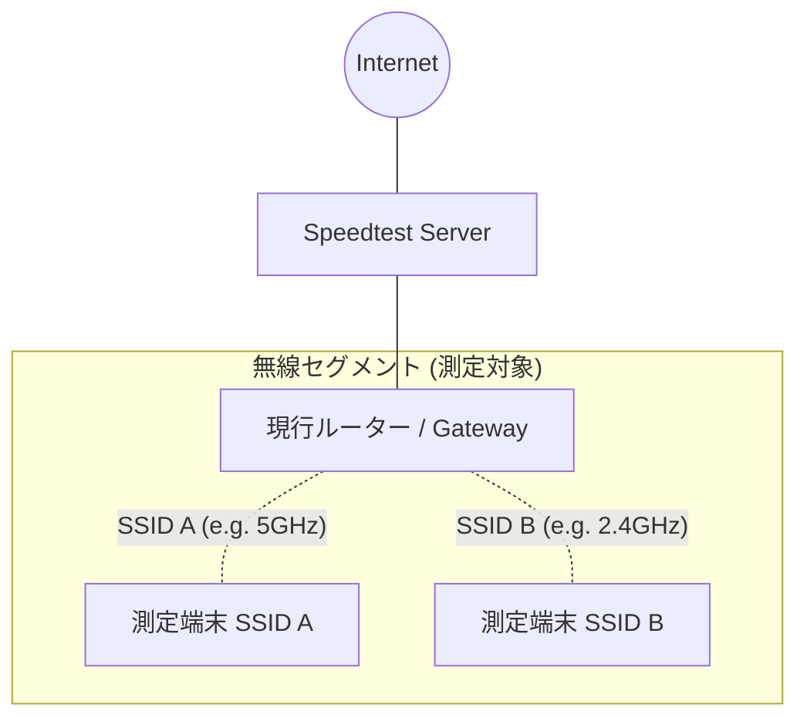

# Wi-Fi Environment Benchmarking Project

## 1. 目的（Objective）

本プロジェクトの目的は、居住空間における異なるWi-Fi環境（周波数帯や規格）が、実際の通信品質および物理的な接続状態に与える影響を定量的に「整理」することです。
外部速度テストの結果と端末側の物理層データ（信号強度や変調効率）を突合し、時間帯や場所による変動を可視化することで、宅内ネットワーク構成を最適化するための客観的なエビデンスを構築します。

## 2. ネットワーク構成（Network Topology）

現行の「シングルゲートウェイ」構成において、外部サーバーを測定の起点とするモデルを採用しています。



## 3. 使用ツール（Toolchain）

| カテゴリ                 | ツール                         | 役割                                                  |
| ------------------------ | ------------------------------ | ----------------------------------------------------- |
| **スループット測定**     | **speedtest-cli**              | 外部ネットワークとの実行通信速度を計測。              |
| **インターフェース制御** | **OS標準ネットワークツール**   | 無線LANの接続先（SSID）の動的な切り替え。             |
| **物理層ステータス取得** | **OS標準ワイヤレス診断ツール** | RSSI（信号強度）やMCS Index（変調符号化方式）の取得。 |
| **自動化・データ処理**   | **スクリプト言語 (Python)**    | 計測プロセスの統合、ログ出力、データの可視化。        |

## 4. speedtest-cli の採用理由

本フェーズにおいて外部サーバーを利用する `speedtest-cli` を採用した理由は以下の通りです。

1. **即時性**: 宅内に専用の計測用サーバーを常設することなく、すぐに検証を開始できる。
2. **実利用感の反映**: 実際のインターネット利用に近い経路でのスループットを確認できる。
3. **拡張性**: 将来的にローカル計測（iperf3等）へ移行する際の、スクリプト構造のひな形として機能する。

## 5. ログ出力フォーマット

計測データは **JSON Lines (JSONL)** 形式で蓄積します。各レコードは自己完結型であり、以下の情報を包括します。

* **時間軸情報**: 計測が実行された日時。
* **識別情報**: 計測対象となったSSIDのラベル。
* **物理層メトリクス**: RSSI、Noise、MCS Indexなどの電波品質指標。
* **パフォーマンスメトリクス**: 下り/上りスループット、およびレイテンシ（Ping）。

## 6. ログ利用方法

1. **SSID別パフォーマンス比較**: 周波数帯ごとの実効速度の分布を分析する。
2. **物理品質と速度の相関分析**: 信号強度の低下がスループットに与える影響度を算出し、死角の特定に役立てる。
3. **時系列変動の可視化**: 時間帯による外部要因（プロバイダの混雑等）と内部要因（Wi-Fi干渉等）の切り分けを行う。

## 7. ディレクトリ構成（Project Structure）

```text
.
├── README.md             # 本書
├── collector.py          # 自動計測エンジン（取得・記録）
├── analyzer.py           # 解析・レポーティング（統計・描画）
└── logs/                 # 時系列データ保存ディレクトリ
    └── benchmark.jsonl   # 構造化ログファイル

```